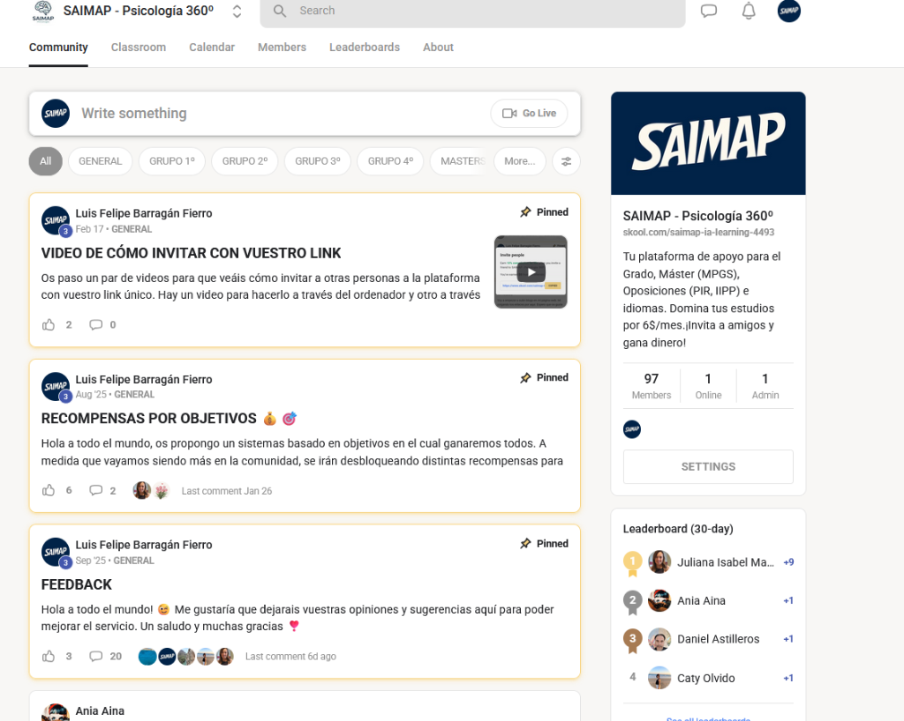
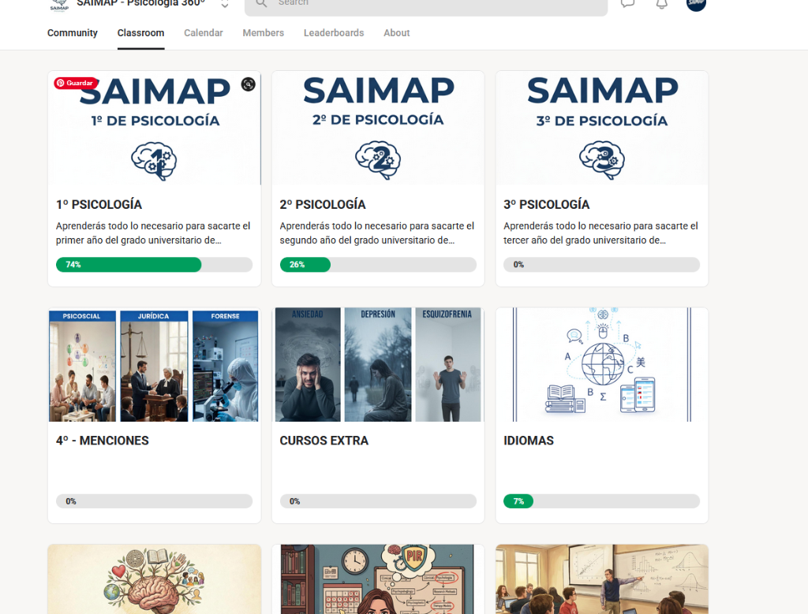
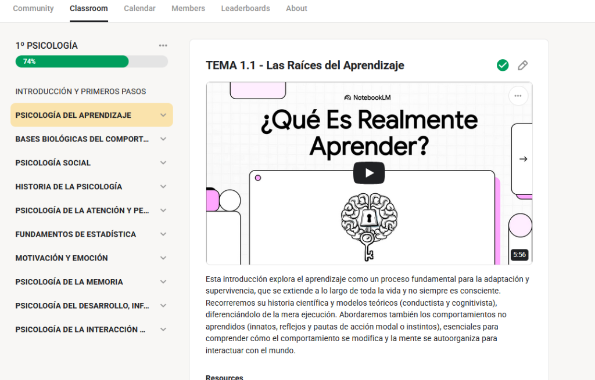
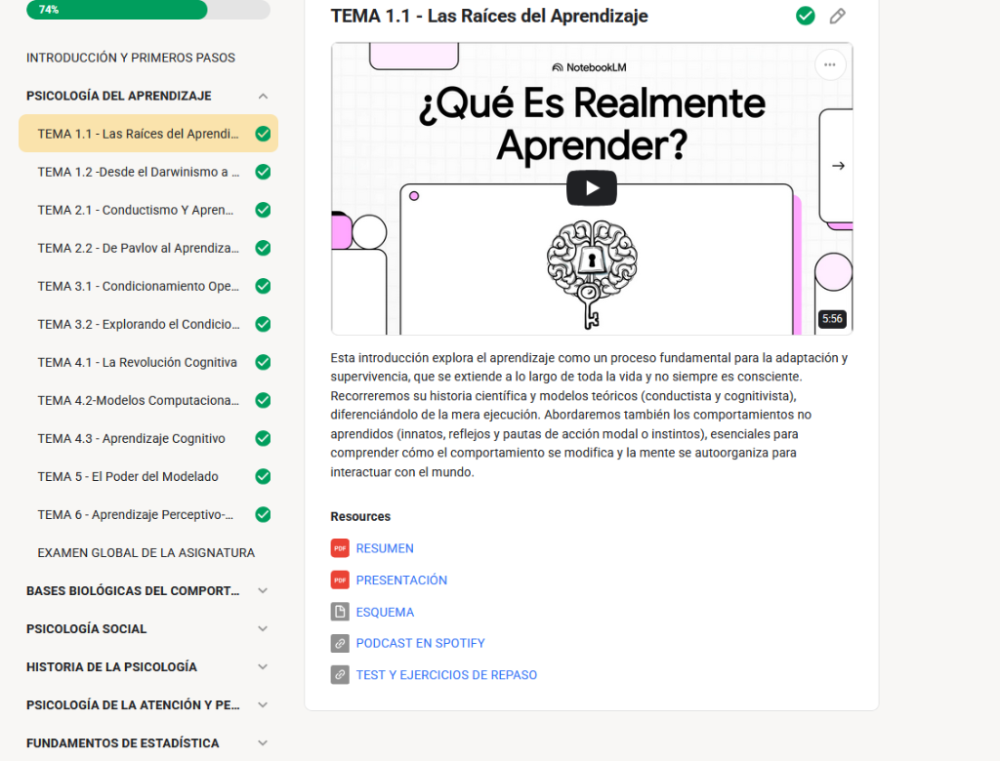
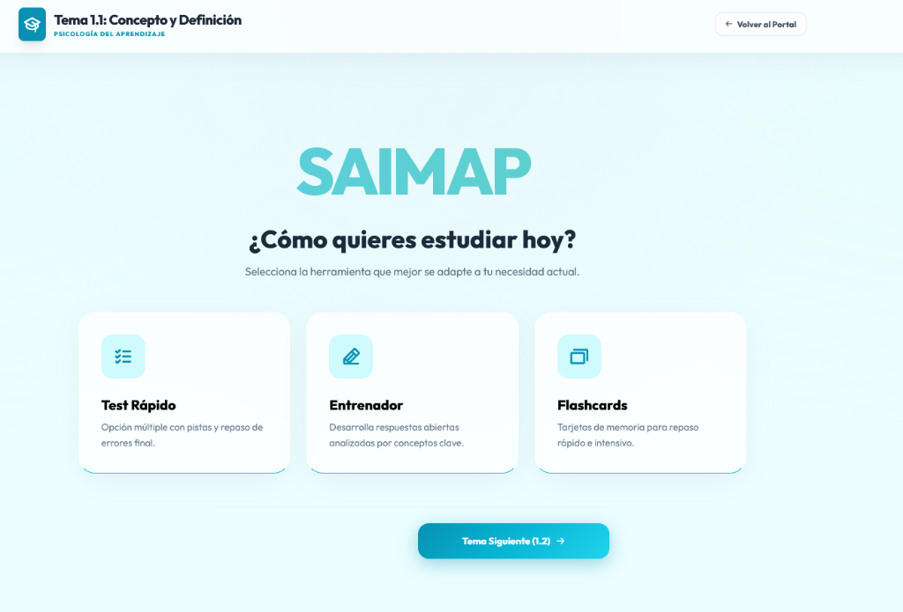
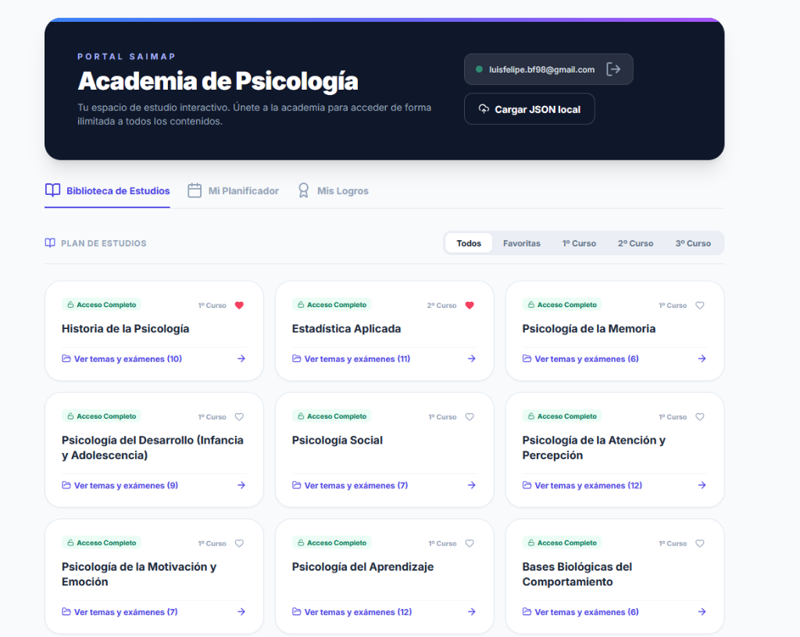
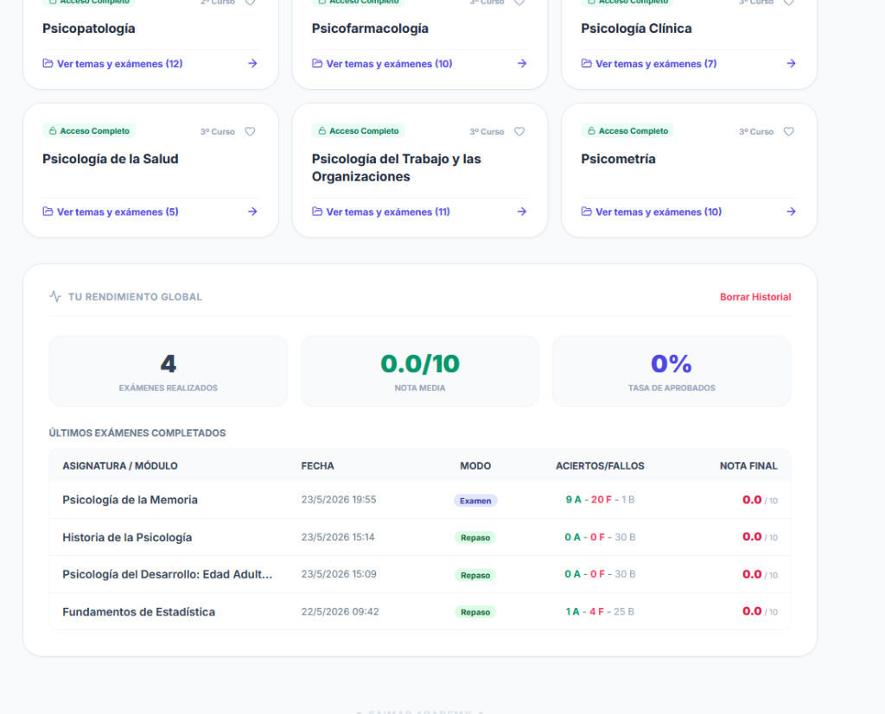
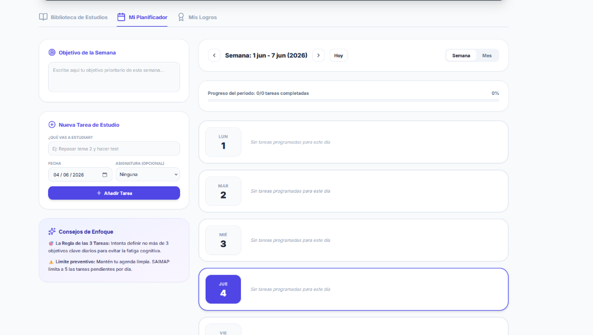
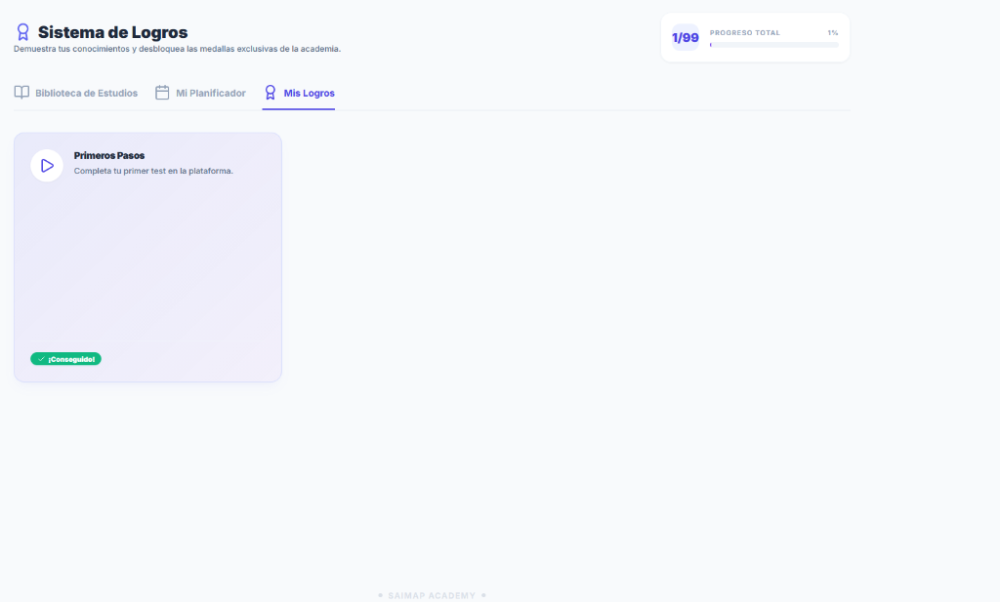
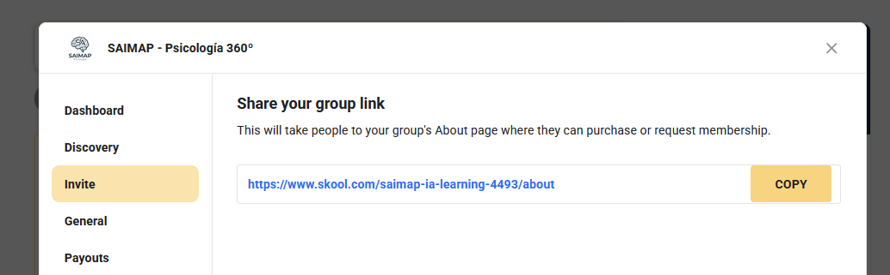

# Guía de Inducción Ampliada: PRIMEROS PASOS en SAIMAP

---

# 📖 Lección 1: Bienvenido a SAIMAP 360º y la Comunidad

¡Hola y bienvenido a **SAIMAP - Psicología 360º**! 🚀

Esta es tu plataforma de apoyo definitiva para superar el Grado, preparar tu Máster (MPGS), Oposiciones (PIR, IIPP) o dominar los idiomas aplicados. Queremos que tu experiencia de estudio sea lo más fluida, dinámica y eficaz posible.

Para empezar, hablemos de nuestro punto de encuentro: la **Comunidad**.

### 🤝 ¿Qué encontrarás en la pestaña Comunidad?

La pestaña **Comunidad** es el corazón social de la academia. Aquí es donde interactuamos todos los días:

1. **Publicar dudas e ideas**: Puedes usar la caja de *"Write something"* para iniciar una conversación, preguntar sobre algún tema de estudio o compartir recursos útiles.
2. **Anuncios importantes**: Estate atento a los posts fijados (*Pinned*). Aquí publicamos novedades clave, vídeos explicativos (como *"Cómo invitar con vuestro link"*) o dinámicas de recompensas.
3. **Secciones por grupos**: Filtra los posts según tu curso o interés (*GENERAL*, *GRUPO 1º*, *GRUPO 2º*, *MASTER*, etc.) para encontrar rápidamente lo que necesitas.
4. **Tabla de clasificación (Leaderboard)**: A la derecha verás el ranking de miembros activos. ¡Aportar valor en la comunidad te ayuda a subir de nivel y desbloquear recompensas!

---

# 🎓 Lección 2: Explora el Classroom (Tus Cursos)

El **Classroom** es tu biblioteca digital de aprendizaje. Aquí es donde se almacena todo el contenido estructurado de la carrera.

### 🗂️ ¿Cómo se organiza el contenido?

Al entrar en la pestaña **Classroom**, verás diferentes carpetas o cursos principales:

* **Cursos Académicos**: Desde **1º de Psicología** hasta **4º - Menciones**, organizados año por año para que no te pierdas.
* **Cursos Extra y Especializaciones**: Formaciones adicionales diseñadas para complementar tu carrera (ej. Cursos sobre Ansiedad, Depresión, Esquizofrenia).
* **Idiomas**: Recursos de apoyo lingüístico esenciales para la psicología moderna.

Cada curso te muestra una **barra de progreso** (*74%*, *26%*, etc.) para que lleves un control visual y motivador de cuánto has avanzado en cada etapa de tu formación.

---

# 📺 Lección 3: Dentro de un Curso y Navegación de Temas

Una vez que haces clic en uno de tus cursos (por ejemplo, **1º de Psicología**), accederás a la zona de estudio estructurado.

### 🧭 Estructura de Navegación Lateral (Izquierda):

En la barra lateral izquierda tendrás la lista completa de asignaturas del curso (ej. *Psicología del Aprendizaje*, *Bases Biológicas*, *Psicología Social*, etc.).

* Al hacer clic en una asignatura, se desplegarán todos los **Temas** ordenados cronológicamente (Tema 1.1, Tema 1.2, etc.).
* Al final de cada lista de temas, encontrarás el acceso al **EXAMEN GLOBAL DE LA ASIGNATURA**.
* Verás un check verde (✔️) al lado de los temas que ya has completado.

### 📺 El Área de Contenido Principal (Derecha):

Al seleccionar un tema, a la derecha aparecerá la información interactiva. Lo primero que verás es un **Vídeo Explicativo integrado** (generalmente un vídeo conciso de unos 5-10 minutos) que te da la introducción conceptual directa del tema para que empieces con una base sólida.

---

# 📦 Lección 4: Recursos de Estudio: Resúmenes, Esquemas y Podcast

Debajo de la descripción de cada tema encontrarás la sección de **Resources (Recursos)**. Estas son las herramientas diseñadas para optimizar tu estudio conceptual:

### 📥 Tus Herramientas Conceptuales:

1. **📄 RESUMEN**: Un documento en PDF condensado y directo al grano con los conceptos teóricos esenciales del tema.
2. **📊 PRESENTACIÓN**: Las diapositivas visuales tipo PowerPoint en PDF para repasar de forma ágil y gráfica.
3. **📐 ESQUEMA**: Un mapa mental o esquema que conecta de forma lógica y visual los conceptos más importantes.
4. **🎙️ PODCAST EN SPOTIFY**: Un audio explicativo en Spotify para que puedas repasar los conceptos en cualquier lugar (caminando, en el transporte, entrenando).

---

# ✍️ Lección 5: La Zona de Repaso (Tus 3 Modos de Estudio)

Cuando haces clic en el enlace **"TEST Y EJERCICIOS DE REPASO"** de cualquier tema, entrarás a la plataforma interactiva de SAIMAP. Esta interfaz te permite elegir cómo quieres estudiar hoy:

### 🛠️ Los 3 Modos de Estudio Interactivos:

1. **📝 Test Rápido**:
   * Preguntas de opción múltiple con opción de ver **pistas** (*Ver Pista*) para ayudarte a resolverlas.
   * Al final del test, tendrás un repaso detallado de todos tus errores con explicaciones analíticas completas.
2. **✍️ Entrenador**:
   * Un método avanzado para desarrollar **respuestas abiertas**. Escribes tus respuestas y la plataforma las analiza en base a conceptos clave del tema.
3. **🗂️ Flashcards**:
   * Tarjetas de memoria digitales ideales para el repaso rápido, la memorización activa y el estudio intensivo de términos clave antes del examen.

---

# 📊 Lección 6: El Portal: Biblioteca y Control de tu Rendimiento

El Portal de SAIMAP te ofrece un centro de control global de todo tu progreso académico a través de la sección **Biblioteca de Estudios**.

### 📚 Plan de Estudios:

Aquí tienes tarjetas para cada una de las asignaturas ordenadas por cursos (1º Curso, 2º Curso, 3º Curso).

* Cada asignatura te muestra tu estado de acceso (*Acceso Completo*) y te permite ver rápidamente todos sus temas y exámenes.
* Puedes marcar asignaturas como **Favoritas** (con el corazón ❤️) para tenerlas siempre a mano en la pestaña correspondiente.

### 📈 Tu Rendimiento Global (Stats de Exámenes):

Si haces scroll hacia abajo en la biblioteca, verás tu panel de control de rendimiento:

* **Exámenes Realizados**: Cantidad acumulada de simulacros y test completados.
* **Nota Media**: Tu puntuación promedio sobre 10.
* **Tasa de Aprobados**: Porcentaje global de acierto.
* **Historial de Últimos Exámenes**: Una tabla detallada con el nombre de la asignatura, la fecha y hora exactas, el modo (Examen o Repaso), el desglose de aciertos/fallos/blancos y tu nota final. ¡Ideal para ver tu evolución a lo largo del tiempo!

---

# 📅 Lección 7: Planifica tu Semana (Mi Planificador)

Una de las herramientas más potentes del Portal de SAIMAP es **Mi Planificador**, tu organizador de tareas y objetivos diseñado específicamente para estudiantes de psicología.

### 🎯 Objetivo de la Semana:

En la esquina superior izquierda puedes redactar tu meta prioritaria de la semana (ej. *"Estudiar el Tema 3 de Fisiológica y hacer 5 test"*). Escribirlo te ayuda a mantener el foco mental.

### 📝 Nueva Tarea de Estudio:

Puedes agendar nuevas tareas indicando:

* ¿Qué vas a estudiar? (ej. *"Repasar tema 2 y hacer test"*)
* Fecha planificada.
* Asignatura asociada (opcional).
* Al pulsar *"Añadir Tarea"*, se colocará automáticamente en tu calendario semanal interactivo a la derecha.

### 💡 Consejos de Enfoque Científico integrados:

* **La Regla de las 3 Tareas**: Intenta definir no más de 3 objetivos clave diarios para evitar la fatiga cognitiva.
* **Límite Preventivo**: Para que tu agenda sea realista, SAIMAP limita tu planificación a un máximo de 5 tareas pendientes por día. ¡Calidad antes que cantidad!

---

# 🏆 Lección 8: Gamificación y el Sistema de Logros

En SAIMAP premiamos tu esfuerzo y tu constancia. Para ello, hemos desarrollado la pestaña **Mis Logros**.

### 🥇 Colecciona Medallas Exclusivas:

* A medida que estudias, realizas test y completas hitos en la plataforma, desbloquearás insignias y medallas.
* Por ejemplo, tu primera medalla será **"Primeros Pasos"** (que se consigue al completar tu primer test en la plataforma).
* Podrás ver tu medalla iluminada y con el sello verde de **¡Conseguido!** en tu colección.
* En la esquina superior derecha verás tu barra de progreso de logros global (ej. *1/99 medallas desbloqueadas*). ¡Intenta conseguirlas todas para demostrar tu dominio de la psicología!

---

# 🔗 Lección 9: Invita a Amigos y Gana Recompensas (Tu Link Único)

¿Sabías que puedes estudiar gratis o incluso ganar dinero recomendando SAIMAP? 💸

En la columna lateral derecha de la **Comunidad**, verás tu **enlace de invitación único** personalizado (ej. `skool.com/saimap-ia-learning-4493...`).

### 👥 ¿Cómo funciona el sistema de afiliados?

1. **Comparte tu enlace**: Copia tu link único y pásaselo a tus compañeros de clase, amigos de carrera o publícalo en tus redes sociales.
2. **Recompensas**: Por cada persona que se registre en la academia a través de tu enlace, recibirás una comisión del 10% mensual recurrente de su suscripción. ¡Invita a 10 personas y tu suscripción será completamente gratuita!
3. **Crecimiento de la Comunidad**: A medida que sumemos más miembros activos, se irán desbloqueando dinámicas de objetivos grupales y recompensas especiales para todos.

---
